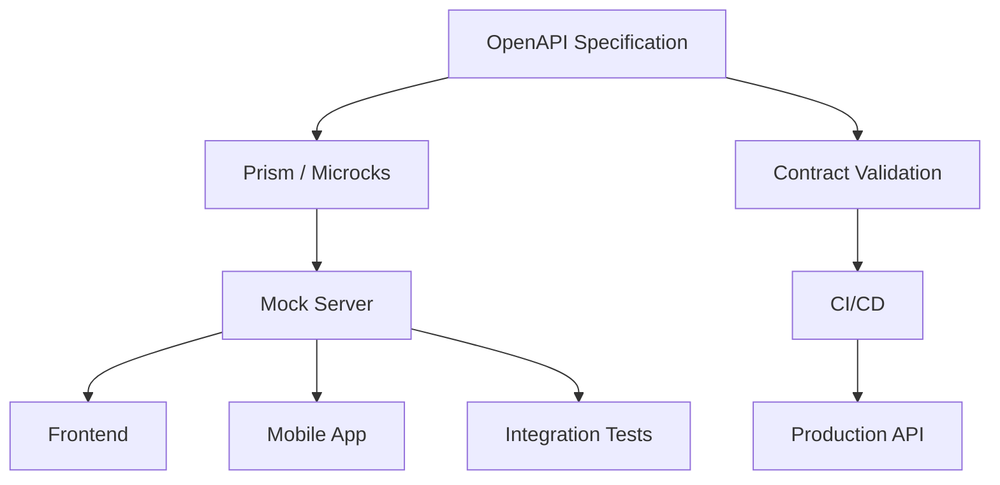
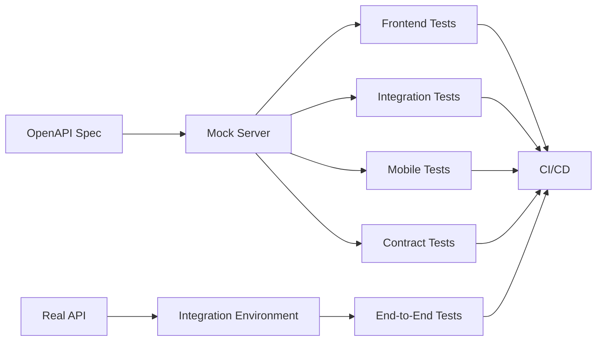
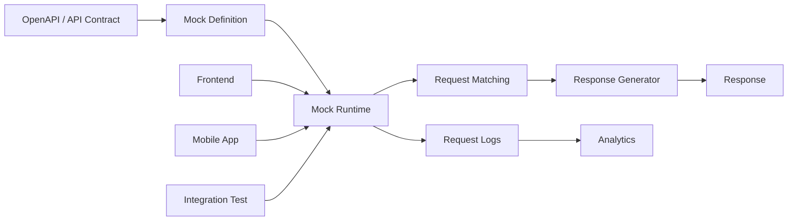

# Awesome-API-Mocking-Platform

# 🎭 Top API Mocking Platforms & Open-Source Mock Servers


> A curated list of **API mocking platforms, mock servers, service virtualization tools, contract-driven mocks and open-source API simulation software** for developing, testing and integrating APIs before production backends are available.


API mocking allows frontend, mobile, QA and integration teams to work against a simulated API without depending on the real backend.


Modern API mocking can cover several levels:


```text

Simple HTTP Stubs

        │

        ▼

Dynamic API Mocking

        │

        ▼

OpenAPI / Contract-Driven Mocking

        │

        ▼

Stateful API Simulation

        │

        ▼

Fault / Latency / Chaos Simulation

        │

        ▼

Multi-Protocol Service Virtualization

```


This repository focuses primarily on **open-source and self-hostable API mocking software**, while keeping commercial SaaS and enterprise platforms in a separate section.


---


## 📑 Table of Contents


* [☁️ SaaS/Hosted Platforms](#️-saashosted-platforms)

* [🌍 Open-Source](#-open-source)

* [🎯 Open-Source API Mock Servers](#-open-source-api-mock-servers)

* [📐 OpenAPI / Contract-Driven Mocking](#-openapi--contract-driven-mocking)

* [⚡ Lightweight API Mocking](#-lightweight-api-mocking)

* [🧪 Advanced API Simulation](#-advanced-api-simulation)

* [🌐 Multi-Protocol Mocking](#-multi-protocol-mocking)

* [💥 Fault Injection & Chaos](#-fault-injection--chaos)

* [📡 Record / Playback Mocking](#-record--playback-mocking)

* [🗃️ Stateful API Mocking](#️-stateful-api-mocking)

* [🧩 Commercial Platform → Open-Source Equivalent](#-commercial-platform--open-source-equivalent)

* [🏗️ API Mocking Architecture](#️-api-mocking-architecture)

* [🔄 Open-Source Contract-Driven Mocking](#-open-source-contract-driven-mocking)

* [🧪 API Testing + Mocking Architecture](#-api-testing--mocking-architecture)

* [⚖️ Commercial vs Open-Source](#️-commercial-vs-open-source)

* [🚀 Recommended Open-Source Stacks](#-recommended-open-source-stacks)

* [📊 API Mocking Technology Comparison](#-api-mocking-technology-comparison)

* [🎯 Recommended Projects by Use Case](#-recommended-projects-by-use-case)

* [🏢 Building a Postman Mock Server Alternative](#-building-a-postman-mock-server-alternative)

* [🌐 Open-Source API Mocking Landscape](#-open-source-api-mocking-landscape)

* [🧠 Why API Mocking Matters](#-why-api-mocking-matters)

* [🤝 Contributing](#-contributing)

* [⚠️ Disclaimer](#️-disclaimer)


---


# ☁️ SaaS/Hosted Platforms


Hosted platforms provide managed mock endpoints, collaborative workflows, browser-based configuration and integrations without requiring teams to operate their own mock infrastructure.


| Platform                                                              | Company        | Primary Focus                     | Key Capabilities                                                      |

| --------------------------------------------------------------------- | -------------- | --------------------------------- | --------------------------------------------------------------------- |

| [Postman Mock Servers](https://www.postman.com/product/mock-servers/) | Postman        | API development & mocking         | Collection-based mocks, examples, dynamic responses, hosted endpoints |

| [Stoplight Prism](https://stoplight.io/open-source/prism)             | Stoplight      | Contract-driven mocking           | OpenAPI mocks, validation proxy, dynamic responses                    |

| [Mockoon Cloud](https://mockoon.com/cloud/)                           | Mockoon        | Hosted API mocking                | Cloud deployment of Mockoon environments                              |

| [Beeceptor](https://beeceptor.com/)                                   | Beeceptor      | API simulation                    | HTTP, REST, SOAP, gRPC, GraphQL, stateful mocks, chaos                |

| [WireMock Cloud](https://www.wiremock.io/)                            | WireMock       | API simulation                    | Advanced matching, stateful simulation, recording, fault injection    |

| [MockLab](https://www.wiremock.io/)                                   | WireMock       | Cloud API mocking                 | Hosted WireMock simulation                                            |

| [MockAPI](https://mockapi.io/)                                        | MockAPI        | REST API prototyping              | CRUD APIs, generated endpoints, hosted mock data                      |

| [ReqRes](https://reqres.in/)                                          | ReqRes         | Simple API mocking                | Hosted test API and mock endpoints                                    |

| [QuickMocker](https://quickmocker.com/)                               | QuickMocker    | Lightweight API mocking           | Hosted mock endpoints and API prototyping                             |

| [Apidog](https://apidog.com/)                                         | Apidog         | API development                   | API design, testing, mocking and documentation                        |

| [ReadyAPI Virtualization](https://smartbear.com/product/ready-api/)   | SmartBear      | Enterprise virtualization         | Service virtualization, API testing and simulation                    |

| [Mountebank](https://www.mbtest.org/)                                 | Mountebank     | Service virtualization            | Multi-protocol imposters and programmable stubs                       |

| [Microcks](https://microcks.io/)                                      | Microcks       | API mocking & testing             | OpenAPI, AsyncAPI, gRPC, GraphQL, SOAP and event-driven mocks         |

| [MockServer](https://www.mock-server.com/)                            | MockServer     | HTTP/HTTPS mocking                | Request matching, expectations, proxying and verification             |

| [WireMock](https://wiremock.org/)                                     | WireMock       | API simulation                    | HTTP mocking, request matching, recording and fault injection         |

| [Mockoon](https://mockoon.com/)                                       | Mockoon        | Local API mocking                 | Desktop UI, CLI, dynamic templates, proxying and rules                |

| [Hoverfly](https://hoverfly.io/)                                      | SpectoLabs     | Service virtualization            | Simulation, capture/playback and middleware                           |

| [Traffic Parrot](https://trafficparrot.com/)                          | Traffic Parrot | Enterprise service virtualization | REST, SOAP and messaging simulation                                   |

| [Parasoft Virtualize](https://www.parasoft.com/products/virtualize/)  | Parasoft       | Enterprise virtualization         | Complex service and dependency simulation                             |

| [Broadcom DevTest Virtualization](https://www.broadcom.com/)          | Broadcom       | Enterprise service virtualization | REST, SOAP, messaging and legacy-system simulation                    |


Postman Mock Servers can be created from collections, mocks or request history and match incoming requests against saved examples. Postman also supports private and public hosted mock servers.


---


# 🌍 Open-Source


The open-source API mocking ecosystem is considerably larger than the hosted-platform market.


The major categories include:


```text

                         API MOCKING

                              │

       ┌──────────────────────┼──────────────────────┐

       │                      │                      │

       ▼                      ▼                      ▼

   Spec-Driven             Stub-Based            Simulation

       │                      │                      │

       ▼                      ▼                      ▼

     Prism                WireMock              Microcks

     Microcks             MockServer            Mountebank

     Mockoon              Mockoon               Hoverfly

       │                      │                      │

       └──────────────────────┼──────────────────────┘

                              │

                              ▼

                     Advanced Simulation

                              │

               ┌──────────────┼──────────────┐

               ▼              ▼              ▼

            Stateful        Chaos        Multi-Protocol

```


---


# 🎯 Open-Source API Mock Servers


| Project                                                      | Description                         | Primary Strength                 |

| ------------------------------------------------------------ | ----------------------------------- | -------------------------------- |

| [WireMock](https://github.com/wiremock/wiremock)             | API mocking and simulation          | Advanced HTTP matching           |

| [MockServer](https://github.com/mock-server/mockserver)      | Programmable HTTP/HTTPS mock server | Expectations and verification    |

| [Mockoon](https://github.com/mockoon/mockoon)                | Desktop + CLI API mocking           | Easy local development           |

| [Microcks](https://github.com/microcks/microcks)             | API mocking and testing platform    | Multi-protocol / contract-driven |

| [Mountebank](https://github.com/bbyars/mountebank)           | Service virtualization              | Multi-protocol imposters         |

| [Hoverfly](https://github.com/SpectoLabs/hoverfly)           | API simulation                      | Capture/playback                 |

| [Prism](https://github.com/stoplightio/prism)                | OpenAPI mock server                 | Contract-driven mocking          |

| [json-server](https://github.com/typicode/json-server)       | Fake REST API server                | Extremely simple REST APIs       |

| [mockd](https://github.com/getmockd/mockd)                   | Multi-protocol mock server          | Single-binary simulation         |

| [Mock Service Worker](https://github.com/mswjs/msw)          | API mocking library                 | Browser / Node.js interception   |

| [WireMock.Net](https://github.com/WireMock-Net/WireMock.Net) | .NET implementation of WireMock     | .NET ecosystem                   |

| [Nock](https://github.com/nock/nock)                         | HTTP mocking for Node.js            | Unit/integration tests           |

| [Polly.JS](https://github.com/Netflix/pollyjs)               | HTTP recording/playback             | JavaScript capture/playback      |

| [Pretender](https://github.com/pretenderjs/pretender)        | Browser HTTP mocking                | Frontend development             |

| [Mock Service Worker](https://github.com/mswjs/msw)          | Request interception                | Browser/server testing           |


WireMock supports JSON, REST APIs, recording/proxying, sophisticated request matching, dynamic response templating and standalone/container deployments.


Mockoon provides a desktop application and CLI, is open source, supports OpenAPI, dynamic templating, rules, JSON databases, proxying, webhooks and TLS.


---


# 📐 OpenAPI / Contract-Driven Mocking


Spec-driven mocking generates behavior from the API contract rather than manually creating every endpoint.


```text

                  OpenAPI Specification

                           │

                           ▼

                    ┌──────────────┐

                    │ Mock Generator│

                    └──────┬───────┘

                           │

                           ▼

                     Mock Server

                           │

                           ▼

                  Frontend / Mobile

                           │

                           ▼

                     API Consumer

```


| Project                                                      | Specification Support                  | Description                         |

| ------------------------------------------------------------ | -------------------------------------- | ----------------------------------- |

| [Prism](https://github.com/stoplightio/prism)                | OpenAPI 2/3                            | Dynamic contract-driven mock server |

| [Microcks](https://github.com/microcks/microcks)             | OpenAPI, AsyncAPI, gRPC, GraphQL, SOAP | Multi-protocol contract testing     |

| [Mockoon](https://github.com/mockoon/mockoon)                | OpenAPI                                | Import/export and local mocking     |

| [WireMock](https://github.com/wiremock/wiremock)             | OpenAPI via tooling/extensions         | Advanced simulation                 |

| [json-server](https://github.com/typicode/json-server)       | JSON                                   | Rapid REST prototyping              |

| [Kreya](https://github.com/riok/kreya)                       | gRPC / APIs                            | API development and testing         |

| [Schemathesis](https://github.com/schemathesis/schemathesis) | OpenAPI / GraphQL                      | Contract-based API testing          |

| [Dredd](https://github.com/apiaryio/dredd)                   | API description formats                | Contract testing                    |


Prism supports OpenAPI v2, v3.0 and v3.1, provides mock servers and a validation proxy, and can generate life-like mock behavior from specifications.


---


# ⚡ Lightweight API Mocking


For simple frontend development and unit/integration tests, a heavyweight service-virtualization platform is often unnecessary.


| Project                                                | Runtime           | Best For                             |

| ------------------------------------------------------ | ----------------- | ------------------------------------ |

| [json-server](https://github.com/typicode/json-server) | Node.js           | Instant REST APIs                    |

| [Mockoon](https://github.com/mockoon/mockoon)          | Desktop / Node.js | Developer-friendly mocks             |

| [Prism](https://github.com/stoplightio/prism)          | Node.js           | OpenAPI-driven mocks                 |

| [Mock Service Worker](https://github.com/mswjs/msw)    | Browser / Node.js | Frontend tests                       |

| [Nock](https://github.com/nock/nock)                   | Node.js           | Unit testing                         |

| [mockd](https://github.com/getmockd/mockd)             | Go                | Single-binary multi-protocol mocking |

| [WireMock](https://github.com/wiremock/wiremock)       | JVM               | Production-like API simulation       |


---


# 🧪 Advanced API Simulation


Simple mocking returns predetermined responses.


Advanced simulation attempts to reproduce **real dependency behavior**.


```text

Request

   │

   ▼

Request Matching

   │

   ├── Headers

   ├── Query Parameters

   ├── Path

   ├── Body

   └── Cookies

   │

   ▼

State / Scenario Engine

   │

   ├── Success

   ├── Validation Error

   ├── Authentication Error

   ├── Rate Limit

   ├── Timeout

   └── Server Error

   │

   ▼

Response Generator

```


| Project     | Advanced Simulation |

| ----------- | :-----------------: |

| WireMock    |          ✅          |

| MockServer  |          ✅          |

| Microcks    |          ✅          |

| Mountebank  |          ✅          |

| Hoverfly    |          ✅          |

| Mockoon     |          ✅          |

| Prism       |          ✅          |

| mockd       |          ✅          |

| json-server |          ⚠️         |

| MSW         |          ✅          |


---


# 🌐 Multi-Protocol Mocking


Modern applications increasingly depend on more than REST/HTTP.


| Project    | REST | SOAP | GraphQL | gRPC | WebSocket | Async/Event |

| ---------- | :--: | :--: | :-----: | :--: | :-------: | :---------: |

| Microcks   |   ✅  |   ✅  |    ✅    |   ✅  |     ⚠️    |      ✅      |

| Mountebank |   ✅  |  ⚠️  |    ⚠️   |  ⚠️  |     ⚠️    |      ⚠️     |

| WireMock   |   ✅  |  ⚠️  |    ⚠️   |  ⚠️  |     ⚠️    |      ⚠️     |

| MockServer |   ✅  |  ⚠️  |    ⚠️   |  ⚠️  |     ⚠️    |      ⚠️     |

| mockd      |   ✅  |   ✅  |    ✅    |   ✅  |     ✅     |      ✅      |

| Hoverfly   |   ✅  |  ⚠️  |    ⚠️   |  ⚠️  |     ⚠️    |      ⚠️     |

| Mockoon    |   ✅  |   ❌  |    ⚠️   |   ❌  |     ✅     |      ⚠️     |

| Prism      |   ✅  |   ❌  |    ❌    |   ❌  |     ❌     |      ❌      |


Microcks explicitly supports OpenAPI, AsyncAPI, gRPC/Protobuf, GraphQL and SOAP, making it particularly interesting for organizations with heterogeneous API ecosystems.


---


# 💥 Fault Injection & Chaos


API mocks can also simulate failures that are difficult to reproduce against real dependencies.


Examples:


```text

HTTP 400

HTTP 401

HTTP 403

HTTP 404

HTTP 409

HTTP 429

HTTP 500

HTTP 502

HTTP 503

HTTP 504


Timeout

Connection Reset

Slow Response

Malformed JSON

Partial Response

Unavailable Dependency

```


| Project    | Latency | Errors | Fault Injection | Stateful |

| ---------- | :-----: | :----: | :-------------: | :------: |

| WireMock   |    ✅    |    ✅   |        ✅        |     ✅    |

| MockServer |    ✅    |    ✅   |        ✅        |     ✅    |

| Microcks   |    ✅    |    ✅   |        ✅        |     ✅    |

| Mountebank |    ✅    |    ✅   |        ✅        |     ✅    |

| Hoverfly   |    ✅    |    ✅   |        ✅        |    ⚠️    |

| Mockoon    |    ✅    |    ✅   |        ✅        |     ✅    |

| Prism      |    ✅    |    ✅   |        ⚠️       |    ⚠️    |

| mockd      |    ✅    |    ✅   |        ✅        |     ✅    |


Beeceptor's current API simulation platform also supports controlled failures, latency and chaos scenarios, illustrating how modern commercial mocking platforms are moving beyond static response stubs.


---


# 📡 Record / Playback Mocking


Instead of manually creating every response:


```text

Real API

   │

   ▼

Proxy / Recorder

   │

   ▼

Captured Requests + Responses

   │

   ▼

Mock Definition

   │

   ▼

Mock Server

```


Useful projects:


| Project    | Recording / Playback |

| ---------- | :------------------: |

| WireMock   |           ✅          |

| Hoverfly   |           ✅          |

| Mountebank |           ✅          |

| Polly.JS   |           ✅          |

| MockServer |           ✅          |

| Mockoon    |           ✅          |

| Nock       |          ⚠️          |

| Microcks   |          ⚠️          |


WireMock supports creating mocks through code, its REST API, JSON files and recording HTTP traffic through a proxy.


---


# 🗃️ Stateful API Mocking


Static mocks can become limiting when the client expects the API to maintain state.


For example:


```text

POST /users

        │

        ▼

Creates User #123

        │

        ▼

GET /users/123

        │

        ▼

Returns User #123

```


Stateful mocking can simulate:


* CRUD operations

* Counters

* Sessions

* Authentication

* Transactions

* Workflows

* Pagination

* State transitions


| Project     | Stateful Mocking |

| ----------- | :--------------: |

| Mockoon     |         ✅        |

| WireMock    |         ✅        |

| MockServer  |         ✅        |

| Microcks    |         ✅        |

| Mountebank  |         ✅        |

| mockd       |         ✅        |

| Beeceptor   |         ✅        |

| json-server |         ✅        |

| Prism       |      Limited     |


---


# 🧩 Commercial Platform → Open-Source Equivalent


| Commercial Platform                   | Open-Source Equivalent / Building Blocks         |

| ------------------------------------- | ------------------------------------------------ |

| **Postman Mock Servers**              | Mockoon + Prism + WireMock                       |

| **Stoplight Prism**                   | Prism itself + Microcks                          |

| **Mockoon Cloud**                     | Mockoon OSS + Docker / Kubernetes                |

| **Beeceptor**                         | WireMock + MockServer + Microcks                 |

| **WireMock Cloud**                    | WireMock OSS + Kubernetes + custom control plane |

| **MockLab**                           | WireMock OSS                                     |

| **MockAPI**                           | json-server + Mockoon                            |

| **ReqRes**                            | json-server + Mockoon                            |

| **QuickMocker**                       | Mockoon + Prism                                  |

| **Apidog**                            | Prism + Mockoon + WireMock + OpenAPI tooling     |

| **ReadyAPI Virtualization**           | WireMock + Microcks + Mountebank + Hoverfly      |

| **Mountebank**                        | Mountebank itself                                |

| **MockServer**                        | MockServer itself                                |

| **Microcks**                          | Microcks itself                                  |

| **Enterprise Service Virtualization** | WireMock + Microcks + Mountebank + Hoverfly      |

| **Cloud Mock API**                    | Mockoon / WireMock + Kubernetes                  |

| **OpenAPI Mocking Service**           | Prism + Mockoon                                  |

| **Multi-Protocol Mocking**            | Microcks + mockd                                 |

| **Frontend API Mocking**              | Mock Service Worker                              |

| **Node.js HTTP Mocking**              | Nock                                             |

| **HTTP Record / Replay**              | Hoverfly + WireMock                              |


---


# 🏗️ API Mocking Architecture


A basic architecture:


```text

                    API Specification

                           │

                           ▼

                    ┌──────────────┐

                    │ Mock Server  │

                    └──────┬───────┘

                           │

              ┌────────────┼────────────┐

              ▼            ▼            ▼

           Frontend      Mobile        Tests

              │            │            │

              └────────────┼────────────┘

                           ▼

                       API Client

```


---


# 🔄 Open-Source Contract-Driven Mocking





This allows frontend and backend teams to work concurrently:


```text

OpenAPI Contract

       │

       ├──────────────► Frontend

       │                  │

       │                  ▼

       │                Mock

       │

       └──────────────► Backend

                          │

                          ▼

                       Real API

```


---


# 🧪 API Testing + Mocking Architecture





---


# 🔁 Parallel API Development


One of the strongest reasons to use mocks is to remove backend/frontend blocking.


```text

                       API Contract

                            │

             ┌──────────────┴──────────────┐

             │                             │

             ▼                             ▼

        Mock Server                   Backend Team

             │                             │

             ▼                             ▼

       Frontend Team                  Real API

             │                             │

             └──────────────┬──────────────┘

                            ▼

                       Integration

```


Instead of:


```text

Backend

   │

   │ wait

   ▼

Frontend

   │

   │ wait

   ▼

Testing

```


teams can work in parallel.


---


# ⚖️ Commercial vs Open-Source


| Capability          | Commercial Platform | Open-Source         |

| ------------------- | ------------------- | ------------------- |

| Hosted Mock URLs    | ✅                   | Build yourself      |

| Local Mocking       | Usually             | ✅                   |

| Self Hosting        | Sometimes           | ✅                   |

| Source Code         | Usually ❌           | ✅                   |

| OpenAPI Mocking     | ✅                   | ✅                   |

| Dynamic Responses   | ✅                   | ✅                   |

| Stateful Simulation | ✅                   | ✅                   |

| Fault Injection     | ✅                   | ✅                   |

| Record / Playback   | Often               | ✅                   |

| Multi-Protocol      | Often               | Some                |

| Collaboration       | Strong              | Build / integrate   |

| Authentication      | Managed             | Self-managed        |

| RBAC                | Often               | Build / integrate   |

| Audit Logs          | Often               | Build / integrate   |

| Analytics           | Often               | Build / integrate   |

| CI/CD               | ✅                   | ✅                   |

| Kubernetes          | Varies              | ✅                   |

| Air-Gapped          | Limited             | ✅                   |

| Customization       | Medium              | Very High           |

| Vendor Lock-In      | Higher              | Lower               |

| Infrastructure Cost | Subscription        | Infrastructure      |

| Enterprise Support  | ✅                   | Community / vendors |

| Data Control        | Vendor-dependent    | Full control        |


---


# 🚀 Recommended Open-Source Stacks


## 🏆 1. Best General-Purpose API Mocking


```text

WireMock

+

Docker

+

OpenAPI

+

CI/CD

```


Best for:


* Backend integration tests

* Third-party API simulation

* Complex request matching

* Stateful scenarios

* Fault injection


---


## 📐 2. Best Contract-Driven Mocking


```text

OpenAPI

   +

Prism

   +

CI/CD

```


Best when the API specification is the source of truth.


---


## 🌐 3. Best Multi-Protocol Stack


```text

Microcks

+

OpenAPI

+

AsyncAPI

+

gRPC

+

GraphQL

+

SOAP

```


Microcks is particularly well suited to organizations with mixed synchronous and event-driven APIs.


---


## ⚡ 4. Best Developer-Friendly Local Mocking


```text

Mockoon

+

OpenAPI

+

Mockoon CLI

+

Docker

```


Mockoon is particularly convenient when developers want a GUI while retaining CLI and CI/CD deployment options.


---


## 🪶 5. Simplest REST Mock


```text

json-server

+

JSON Database

```


Excellent for:


* Frontend prototypes

* CRUD applications

* Demos

* Tutorials

* Rapid development


---


## 🧪 6. Browser / Frontend Mocking


```text

Mock Service Worker

        +

React / Vue / Angular

        +

Jest / Vitest / Playwright

```


Requests are intercepted at the network boundary rather than requiring a separately deployed mock server.


---


## 💥 7. Fault & Chaos Simulation


```text

WireMock

+

Mountebank

+

Hoverfly

+

Latency / Error Injection

```


Useful for testing:


* Retry logic

* Circuit breakers

* Timeouts

* Fallbacks

* Rate limits

* Dependency failures


---


## 🏢 8. Enterprise Service Virtualization


```text

Microcks

+

WireMock

+

Mountebank

+

Hoverfly

+

Kubernetes

+

CI/CD

```


---


# 📊 API Mocking Technology Comparison


| Project     | Open Source | OpenAPI | Stateful | Record/Replay | Fault Injection | Multi-Protocol | GUI |

| ----------- | :---------: | :-----: | :------: | :-----------: | :-------------: | :------------: | :-: |

| WireMock    |      ✅      |    ✅*   |     ✅    |       ✅       |        ✅        |       ⚠️       |  ⚠️ |

| MockServer  |      ✅      |    ⚠️   |     ✅    |       ✅       |        ✅        |       ⚠️       |  ❌  |

| Mockoon     |      ✅      |    ✅    |     ✅    |       ✅       |        ✅        |       ⚠️       |  ✅  |

| Microcks    |      ✅      |    ✅    |     ✅    |       ⚠️      |        ✅        |        ✅       |  ✅  |

| Mountebank  |      ✅      |    ⚠️   |     ✅    |       ✅       |        ✅        |        ✅       |  ❌  |

| Hoverfly    |      ✅      |    ⚠️   |    ⚠️    |       ✅       |        ✅        |       ⚠️       |  ❌  |

| Prism       |      ✅      |    ✅    |    ⚠️    |       ❌       |        ⚠️       |        ❌       |  ❌  |

| json-server |      ✅      |    ⚠️   |     ✅    |       ❌       |        ❌        |        ❌       |  ❌  |

| mockd       |      ✅      |    ⚠️   |     ✅    |       ⚠️      |        ✅        |        ✅       |  ❌  |

| MSW         |      ✅      |    ⚠️   |    ⚠️    |       ❌       |        ⚠️       |  HTTP-focused  |  ❌  |

| Nock        |      ✅      |    ❌    |    ⚠️    |       ⚠️      |        ⚠️       |      HTTP      |  ❌  |

| Polly.JS    |      ✅      |    ❌    |    ⚠️    |       ✅       |        ⚠️       |      HTTP      |  ❌  |


`*` OpenAPI support may be provided through specific tooling, integrations or extensions depending on the project/version.


---


# 🎯 Recommended Projects by Use Case


| Use Case                     | Recommended Starting Point           |

| ---------------------------- | ------------------------------------ |

| Best general API mocking     | **WireMock**                         |

| OpenAPI-first mocking        | **Prism**                            |

| Multi-protocol API mocking   | **Microcks**                         |

| Developer-friendly GUI       | **Mockoon**                          |

| Java/JVM testing             | **WireMock / MockServer**            |

| .NET mocking                 | **WireMock.Net**                     |

| Node.js unit testing         | **Nock**                             |

| Browser API mocking          | **Mock Service Worker**              |

| REST prototype               | **json-server**                      |

| Service virtualization       | **Mountebank**                       |

| Record / replay              | **Hoverfly / WireMock**              |

| Complex HTTP matching        | **WireMock**                         |

| Stateful simulation          | **WireMock / MockServer / Mockoon**  |

| Chaos / fault injection      | **WireMock / Mountebank / Hoverfly** |

| gRPC mocking                 | **Microcks / mockd**                 |

| GraphQL mocking              | **Microcks / mockd**                 |

| SOAP mocking                 | **Microcks / Mountebank**            |

| AsyncAPI mocking             | **Microcks**                         |

| Single-binary multi-protocol | **mockd**                            |

| Enterprise Kubernetes        | **Microcks**                         |

| CI/CD contract mocking       | **Prism / Microcks**                 |

| Frontend development         | **Mockoon / MSW**                    |

| Mobile development           | **WireMock / Mockoon**               |


---


# 🏢 Building a Postman Mock Server Alternative


A hosted Postman-style mock service can be decomposed into:


```text

                         API Specification

                                │

                                ▼

                         Mock Definition

                                │

                                ▼

                        ┌───────────────┐

                        │ Mock Control  │

                        │     Plane     │

                        └───────┬───────┘

                                │

                                ▼

                          Mock Runtime

                                │

             ┌──────────────────┼──────────────────┐

             ▼                  ▼                  ▼

          Request            Matching           Response

          Routing             Engine             Engine

             │                  │                  │

             └──────────────────┼──────────────────┘

                                ▼

                         Public Mock URL

```


Possible components:


```text

Mock Engine       → WireMock / Prism

API Specification → OpenAPI

Database          → PostgreSQL

Object Storage    → MinIO

API Gateway       → Kong / Traefik

Authentication    → Keycloak

Containerization  → Docker

Orchestration     → Kubernetes

Queue             → NATS / Kafka

Observability     → Prometheus + Grafana

```


Postman itself supports hosted mock servers and local mock execution; its hosted servers can be created from collections and examples, while its local mock functionality can run during development.


---


# ☁️ Building a Mock API SaaS


A hosted mock platform can be structured into:


```text

                       CUSTOMER

                          │

                          ▼

                    Web Dashboard

                          │

                          ▼

                      API Gateway

                          │

              ┌───────────┴───────────┐

              ▼                       ▼

       Authentication             API Control Plane

              │                       │

              │                ┌──────┴──────┐

              │                ▼             ▼

              │             Projects      Mock Config

              │                │             │

              └────────────────┴──────┬──────┘

                                      ▼

                               Mock Runtime

                                      │

                         ┌────────────┼────────────┐

                         ▼            ▼            ▼

                     Tenant A      Tenant B      Tenant C

                         │            │            │

                         ▼            ▼            ▼

                      Mock API     Mock API     Mock API

```


---


# 🔐 Multi-Tenant Mocking Platform


For a SaaS alternative:


```text

                         SaaS Control Plane

                                │

              ┌─────────────────┼─────────────────┐

              │                 │                 │

              ▼                 ▼                 ▼

           Tenant A          Tenant B          Tenant C

              │                 │                 │

              ▼                 ▼                 ▼

          Mock Server       Mock Server       Mock Server

              │                 │                 │

              └─────────────────┼─────────────────┘

                                ▼

                         Shared Platform

                                │

             ┌──────────────────┼──────────────────┐

             ▼                  ▼                  ▼

         PostgreSQL           Redis             MinIO

```


Important isolation requirements include:


* Tenant-specific URLs

* API keys

* Authentication

* Rate limiting

* Resource quotas

* Request logging

* Mock configuration isolation

* Network isolation

* Usage metering


---


# 🧪 API Mocking Pipeline





---


# 🔄 Mocking → Testing → Production


```text

                  API Contract

                       │

                       ▼

                  Mock Server

                       │

          ┌────────────┼────────────┐

          ▼            ▼            ▼

       Frontend      Mobile       Tests

          │            │            │

          └────────────┼────────────┘

                       ▼

                Integration

                       │

                       ▼

                  Staging API

                       │

                       ▼

                  Production

```


The mock should ideally remain synchronized with the API contract throughout this lifecycle.


---


# 🧠 Mocking vs Service Virtualization


| Capability             | API Mocking | Service Virtualization |

| ---------------------- | ----------- | ---------------------- |

| Simple HTTP responses  | ✅           | ✅                      |

| OpenAPI mocks          | ✅           | ✅                      |

| Dynamic responses      | ✅           | ✅                      |

| Stateful behavior      | ⚠️          | ✅                      |

| Multiple dependencies  | ⚠️          | ✅                      |

| SOAP                   | Sometimes   | ✅                      |

| JMS / messaging        | Rare        | ✅                      |

| Legacy systems         | Rare        | ✅                      |

| Database simulation    | Rare        | Sometimes              |

| Fault injection        | ✅           | ✅                      |

| Complex workflows      | ⚠️          | ✅                      |

| Enterprise integration | ⚠️          | ✅                      |


A useful distinction is:


```text

API Mocking

    ↓

"I need this endpoint to return a response."


Service Virtualization

    ↓

"I need to simulate an entire dependency."

```


---


# 🌐 Open-Source API Mocking Landscape


```mermaid

mindmap

  root((API Mocking))

    OpenAPI

      Prism

      Microcks

      Mockoon

      WireMock

    HTTP Mocking

      WireMock

      MockServer

      Mockoon

      MockServer

      json-server

    Multi Protocol

      Microcks

      Mountebank

      mockd

      Hoverfly

    Record Replay

      WireMock

      Hoverfly

      Mountebank

      Polly.JS

    Frontend

      MSW

      Nock

      Pretender

    Stateful

      WireMock

      MockServer

      Mockoon

      Microcks

    Chaos

      WireMock

      MockServer

      Mountebank

      Hoverfly

      mockd

    Contract Testing

      Prism

      Microcks

      Dredd

      Schemathesis

    Enterprise

      Microcks

      WireMock

      Mountebank

      Hoverfly

    Hosted

      Postman

      Beeceptor

      WireMock Cloud

      Mockoon Cloud

      MockAPI

      ReqRes

      Apidog

```


---


# 🔥 Why API Mocking Matters


Without mocking:


```text

Frontend

    │

    ▼

Backend

    │

    ▼

Database

    │

    ▼

Third Party API

    │

    ▼

Payment / Identity / External Dependency

```


A single unavailable dependency can block the entire development workflow.


With mocking:


```text

Frontend

    │

    ▼

Mock API

    │

    ├── Success

    ├── Validation Error

    ├── Authentication Error

    ├── Rate Limit

    ├── Timeout

    └── Server Error

```


This allows teams to develop against scenarios that are difficult, expensive or impossible to reproduce using real services.


---


# 🧠 The Ideal API Development Workflow


```text

                API Design

                    │

                    ▼

              OpenAPI Contract

                    │

          ┌─────────┴─────────┐

          ▼                   ▼

      Mock Server          Backend

          │                   │

          ▼                   ▼

      Frontend            Unit Tests

          │                   │

          └─────────┬─────────┘

                    ▼

              Contract Tests

                    │

                    ▼

             Integration Tests

                    │

                    ▼

                Staging

                    │

                    ▼

              Production

```


The key idea is:


> **The API contract becomes the coordination layer between consumers, producers and test infrastructure.**


---


# 🏆 Recommended Open-Source Reference Architecture


For a serious self-hosted API mocking environment:


```text

                     ┌──────────────────┐

                     │   OpenAPI Spec   │

                     └────────┬─────────┘

                              │

                              ▼

                     ┌──────────────────┐

                     │      Prism      │

                     └────────┬─────────┘

                              │

                              ▼

                       Contract Mock

                              │

                              ▼

                     ┌──────────────────┐

                     │    WireMock     │

                     └────────┬─────────┘

                              │

             ┌────────────────┼────────────────┐

             ▼                ▼                ▼

          Frontend         Mobile           CI/CD

             │                │                │

             └────────────────┼────────────────┘

                              ▼

                     Integration Tests

                              │

                              ▼

                          Microcks

                              │

                    ┌─────────┼─────────┐

                    ▼         ▼         ▼

                  gRPC      GraphQL    SOAP

```


---


# 🧱 Open-Source API Mocking Stack


```text

┌──────────────────────────────────────────────┐

│                API Consumers                 │

│   Web • Mobile • QA • Integration Tests      │

└───────────────────────┬──────────────────────┘

                        │

┌───────────────────────▼──────────────────────┐

│              API Mocking Layer               │

│ WireMock • Prism • Mockoon • Microcks        │

└───────────────────────┬──────────────────────┘

                        │

┌───────────────────────▼──────────────────────┐

│             Simulation Layer                 │

│ State • Rules • Templates • Faults • Latency │

└───────────────────────┬──────────────────────┘

                        │

┌───────────────────────▼──────────────────────┐

│            Contract Layer                    │

│ OpenAPI • AsyncAPI • GraphQL • Protobuf      │

└───────────────────────┬──────────────────────┘

                        │

┌───────────────────────▼──────────────────────┐

│             Infrastructure                   │

│ Docker • Kubernetes • PostgreSQL • Redis     │

└──────────────────────────────────────────────┘

```


---


# 🤝 Contributing


Contributions are welcome!


Please consider adding:


* API mock servers

* OpenAPI mock generators

* Contract-driven mock tools

* Service virtualization platforms

* Multi-protocol mock servers

* HTTP mock libraries

* Browser mocking libraries

* Record/replay tools

* Stateful simulation engines

* Chaos/fault-injection tools

* gRPC mocking tools

* GraphQL mocking tools

* SOAP mocking tools

* AsyncAPI mocking tools

* WebSocket mocking tools

* Mock SaaS platforms

* Self-hosted alternatives

* Kubernetes operators

* CI/CD integrations

* API testing integrations


When adding a project, distinguish between:


* **Fully open-source**

* **Open-core**

* **Source available**

* **Hosted SaaS**

* **Commercial enterprise software**

* **Open-source library**

* **Commercial cloud built around an open-source core**


Always verify the current license before describing a project as open source.


---


# ⚠️ Disclaimer


This repository is an independent technical curation and is **not affiliated with or endorsed by any company or project listed here**.


API mocking tools differ substantially in architecture and intended use.


A lightweight mock server is not necessarily a replacement for enterprise service virtualization.


Likewise:


```text

json-server

      ≠

WireMock

      ≠

Microcks

      ≠

Enterprise Service Virtualization

```


Each solves a different part of the API simulation problem.


Open-source projects may also have different licensing terms for:


* Source code

* Plugins

* Extensions

* Hosted services

* Commercial use

* Redistribution


Always verify the current project license and documentation before commercial deployment.


---


## ⭐ Star This Repository


If you are interested in:


* API Mocking

* API Simulation

* Service Virtualization

* OpenAPI

* Contract Testing

* API Testing

* Developer Tools

* Microservices

* CI/CD

* Open-Source API Infrastructure


consider giving this repository a ⭐ **Star** and contributing new projects.


---


**Last updated: September 2026**
